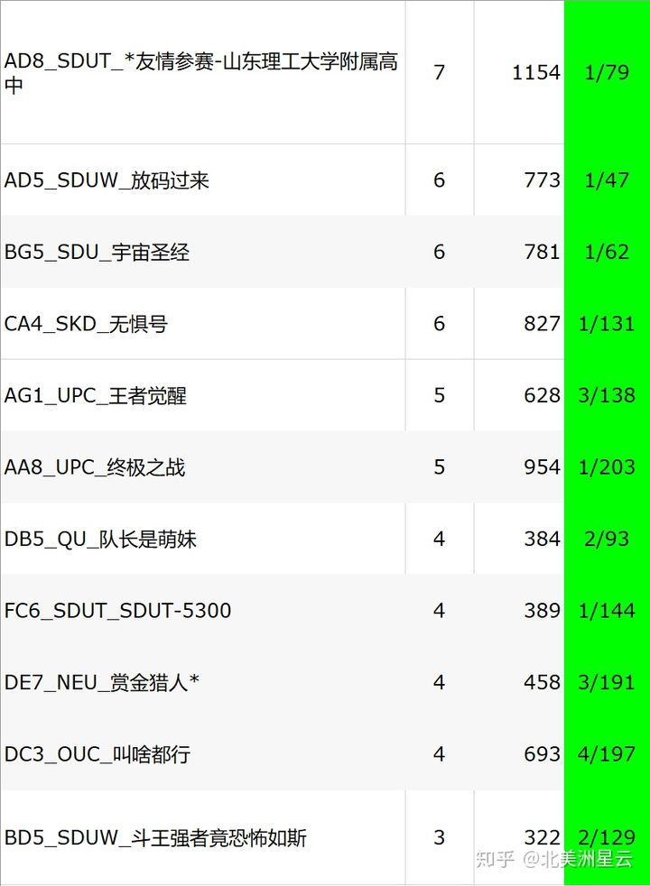
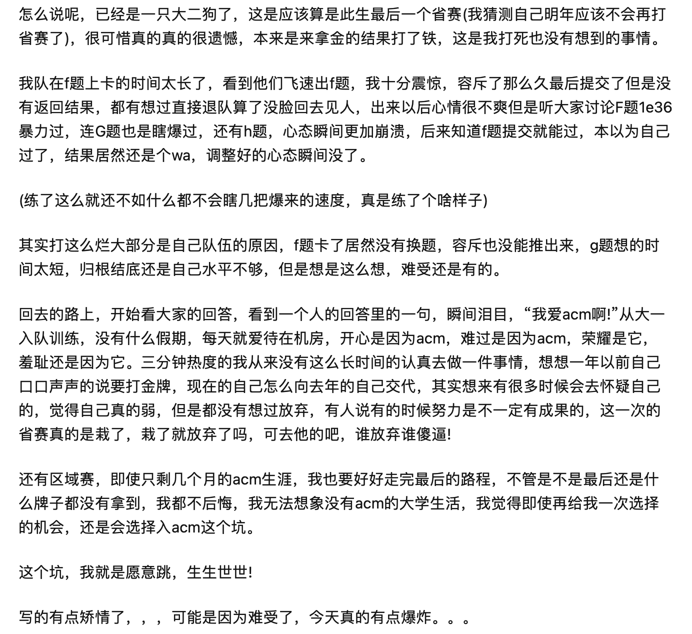
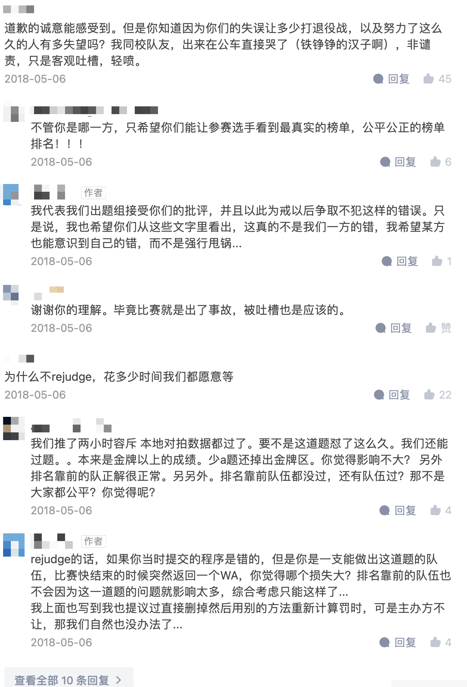
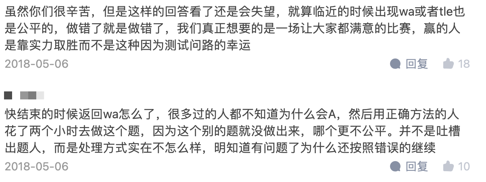
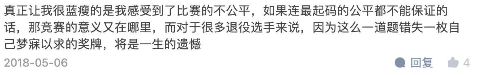
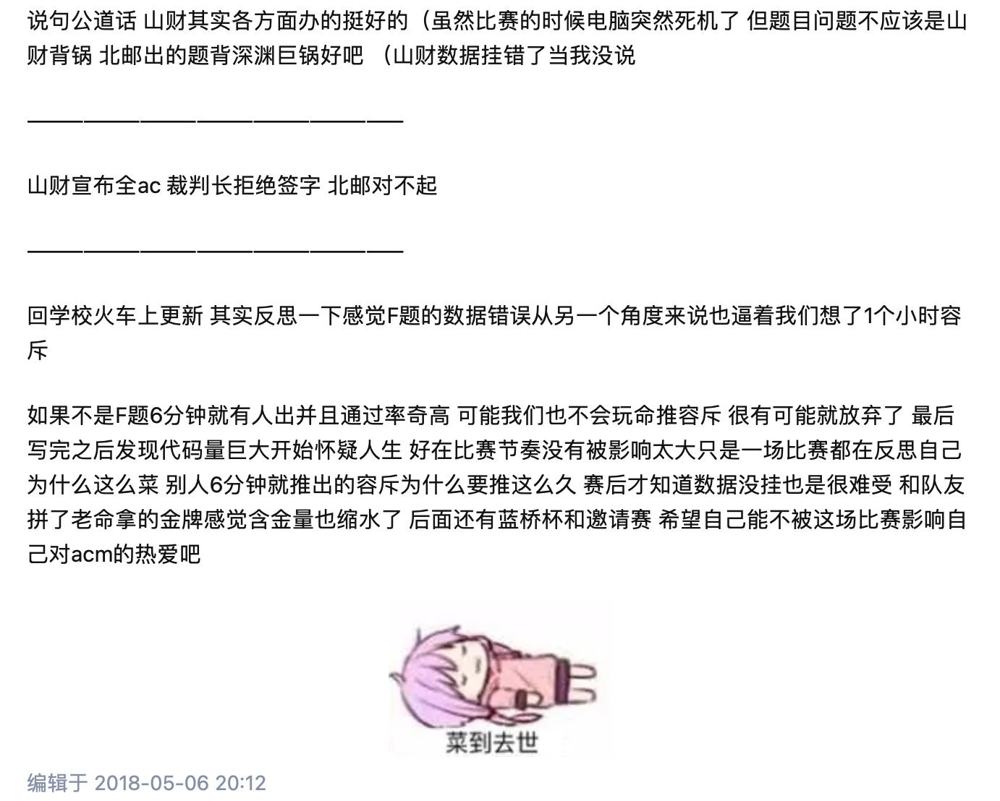

# sdcpc9th

在整理这个榜单时，algoUX 团队注意到此比赛存在较大争议，在结合 [知乎](https://www.zhihu.com/question/272062934) 以及与部分圈内人的交流之后，我们对此比赛有了一个大概的回顾。

此次比赛最大争议来自于 F 题，该题作为比赛中难度较大的题目，因没有配置测试数据导致大量队伍可以用任何解法 AC。并且由于竞赛软件、裁判疏忽以及主办方与裁判方的沟通问题，截至比赛结束仍未妥善处理该事故，最终主办方选择维持原榜作为最终成绩，进而引发选手争议。

在充分参考当时的讨论和群聊记录归档后，algoUX 团队决定收录重判榜单。这不仅来自当时选手的呼声，也来自我们的价值观判断。尽管赛时不做任何补救已是很低级的失误，但事情已经发生，结果已无法改变，对所有参赛选手来说，与其承认原榜结果及其造成的不公平，我们更愿意让大家有机会看到真实的结果，了解到自己和对手的水平。而重判了 F 题的榜单显然更加公平和公正，这也是除了重赛以外的最佳补救方案。我们认为有必要将重判榜单作为必要的补充，这是对选手和竞赛本身更负责的方式。

在试图还原更能体现真实成绩的重判榜单时，幸运的是，我们轻松地找到了当年主办方山东财经大学提供的重判数据，共有 11 支队伍通过了这道题。同时还有爱好者制作了 [一键重判脚本](https://github.com/1e42-ng-computer/rej.js-for-SDCPC9/)，这极大减轻了我们的工作量。感谢所有热爱这个领域并为之付出的同学们。

## 附录

### 重判结果

通过 F 题的队伍，来自 [知乎](https://www.zhihu.com/question/272062934/answer/365222687)，原回答已删除：

### 选手的声音

algoUX 团队原则上尽可能保持理性中立，但我们的成员作为曾经的圈内选手，在还原事件的过程中还是不止一次被当时选手们的声音所触动，因此节选了一部分。这些声音应该被记录下来，选手们的努力不应被辜负，它们也是这个事件的一部分。

愿大家永远年轻，永远热泪盈眶。

